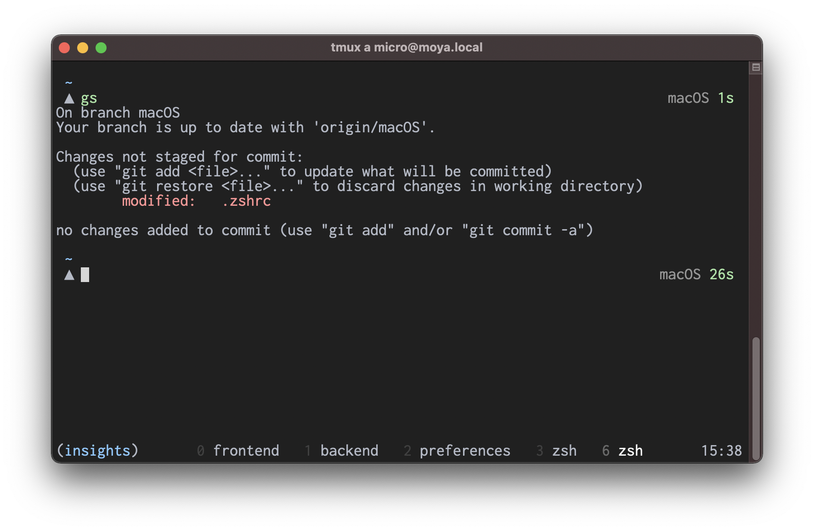

[jedahan][]'s dotfiles for [zsh][], [tmux][], [git][], [openssh][], and [neovim][] on [macOS][].

Customizations are minimal, understandable, and independent, so newcomers can dive in.

> check out [the linux branch](https://github.com/jedahan/dotfiles/tree/linux)

### Installation

Clone this repository

    git clone https://github.com/jedahan/dotfiles.git $HOME/.dotfiles

Backup existing files

    git -C $HOME/.dotfiles ls-files -z | xargs -0 -I _ mv -vi "$HOME/_" "$HOME/_.backup"

Symlink dotfiles to home directory

    git -C $HOME/.dotfiles ls-files -z | xargs -0 -I _ ln -sf "$HOME/.dotfiles/_" "$HOME/_"

### Usage

Manage changes with `git` in your home directory

    git status

To track or untrack new dotfiles easily, install [jedahan/track][]

    git clone https://github.com/jedahan/track && source track/track.zsh

Tracking a new file

    track .config/gh/config.yml

Untracking a file

    untrack .config/gh/config.yml

### Uninstallation

Backup existing files

    git -C $HOME/.dotfiles ls-files -z | xargs -0 -I _ mv -vi "$HOME/_" "$HOME/_.backup"

Copy dotfiles from repo back to home

    git -C $HOME/.dotfiles ls-files -z | xargs -0 -I _ cp -i "$HOME/.dotfiles/_" "$HOME/_"

[jedahan]: http://jonathan.is
[zsh]: https://zsh.org
[git]: https://git-scm.com
[tmux]: https://tmux.github.io
[openssh]: https://openssh.com
[neovim]: https://neovim.io
[macOS]: https://www.apple.com/macos/big-sur
[jedahan/track]: http://github.com/jedahan/track
