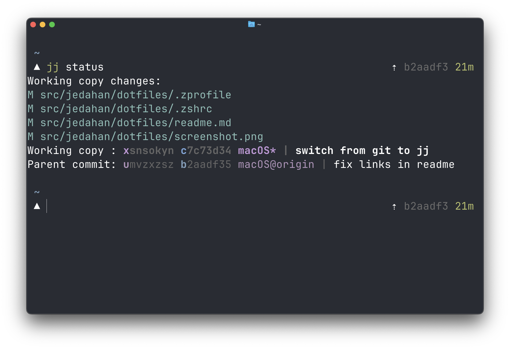

[jedahan][]'s dotfiles for [ghostty][], [zsh][], [hx][], [jj][], [ssh][], and [mpv][] on [macOS][].

Customizations are minimal, understandable, and independent, so newcomers can dive in.

> check out [the linux branch](https://github.com/jedahan/dotfiles/tree/linux)

### Installation

Clone this repository

    jj git clone https://github.com/jedahan/dotfiles.git ~/.dotfiles

Backup existing files

    jj --repository ~/.dotfiles file list | xargs -I _ mv -vi "$HOME/_" "$HOME/_.backup"

Symlink dotfiles to home directory

    jj --repository ~/.dotfiles file list | xargs -I _ ln -sf "$HOME/.dotfiles/_" "$HOME/_"

Setup function for managing dotfiles when in home directory

    jj() { command jj --repository ${PWD:/${HOME}/.dotfiles} $* }

### Usage

Manage changes with `jj` in your home directory

    jj status

Add a config file to git

    cd
    mv .config/app.toml .dotfiles/.config/app.toml
    ln -sf .dotfiles/.config/app.toml ~/.config/app.toml
    jj describe --message 'track app config'

### Uninstallation

Backup existing files

    jj --repository ~/.dotfiles ls-files -z | xargs -0 -I _ mv -vi "$HOME/_" "$HOME/_.backup"

Copy dotfiles from repo back to home

    jj --repository ~/.dotfiles ls-files -z | xargs -0 -I _ cp -i "$HOME/.dotfiles/_" "$HOME/_"

[jedahan]: http://jonathan.is

[ghostty]: https://github.com/ghostty-org/ghostty
[hx]: https://helix-editor.com
[jj]: https://martinvonz.github.io/jj
[macOS]: https://www.apple.com/macos/sequoia
[mpv]: https://mpv.io
[ssh]: https://openssh.com
[zsh]: https://zsh.org
